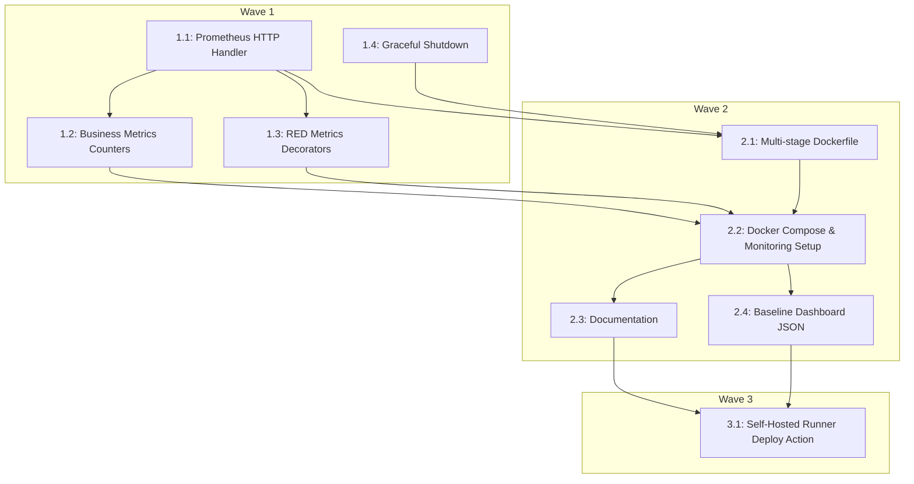

# Plan: Heroku to Mac Mini Migration

## Goal
Migrate the `tbd-bot` deployment architecture from Heroku to an M4 Mac Mini home server. This involves optimizing the Docker container, establishing deep application metrics (Prometheus/Grafana), and setting up automated CI/CD via a local GitHub Runner.

## Architecture
- **Metrics:** `prometheus/client_golang` integrated into the existing port 8080 HTTP server. Includes business logic counters and RED decorators for Discord events.
- **Docker Compose:** Standard orchestrator (`docker-compose.yml`) mapping to a `.env` file for secrets. Runs the bot (with `GOMEMLIMIT` and memory limits), Prometheus (14d/1GB limits), and Grafana (IaC Provisioning on `127.0.0.1:3000`).
- **CI/CD:** GitHub Actions targeting a `self-hosted` runner running on the Mac Mini. Includes concurrency control, secure `.env` injection, and true Docker health-check polling.

## Global Constraints
- The Mac Mini must maintain persistent internet access for the Discord WebSocket session.
- Secrets (`BOTTOKEN`, etc.) must be stored securely in a local `.env` file on the Mac Mini, and securely injected into the GitHub Actions workspace.
- Deployments must be automated via GitHub Actions. **Self-hosted runner security must be enforced** by strictly tying workflows to the `main` branch and disabling workflows from fork Pull Requests via GitHub Repository Settings.
- The system and application timezone must remain in UTC.
- The bot must avoid Discord Gateway bans by implementing a graceful `SIGTERM` shutdown that calls `discordgo.Session.Close()`.

## Progress

| Task | Wave | Status | Evidence |
|------|------|--------|----------|
| 1.1  | 1    | completed | `TestMetricsEndpoint` passed in `main_test.go` |
| 1.2  | 1    | completed | `TestBusinessMetricsRegistered` and `TestMetricsEndpoint` passed |
| 1.3  | 1    | completed | `TestREDMetricsDecorators` and `TestAllExpandedBusinessMetrics` passed in `util/metrics_test.go` |
| 1.4  | 1    | completed | `TestGracefulShutdown_SIGINT` and `TestGracefulShutdown_SIGTERM` passed in `main_test.go` |
| 2.1  | 2    | completed | `TestDockerfile_MultiStageAndHealthcheck` passed & `scripts/verify_dockerfile.sh` verified static rules + Go static build |
| 2.2  | 2    | completed | `TestDockerComposeAndMonitoringSetup` passed in `main_test.go` & valid `docker-compose.yml`, `prometheus/`, `grafana/` configs created |
| 2.3  | 2    | completed | `TestDocumentation_GrafanaAndRunnerSecurity` passed in `main_test.go` & `README.md` updated |
| 2.4  | 2    | completed | `TestGrafanaDashboardJSON` passed in `main_test.go` & valid JSON at `grafana/provisioning/dashboards/bot-dashboard.json` |
| 3.1  | 3    | completed | Verified `deploy.yml` with `actionlint` and `TestDeployWorkflow` in `main_test.go` |

## Diagram

## Wave 1

### Task 1.1: Prometheus HTTP Handler
**Files:** Modify `main.go`, `go.mod`, `go.sum`
**Write-scope:** `main.go`, `go.mod`, `go.sum`
**Consumes:** Existing port 8080 HTTP server setup
**Produces:** A `/metrics` endpoint serving default Go metrics using `github.com/prometheus/client_golang/prometheus/promhttp`.
**Seams:** HTTP boundary.
**Tests:** `go test` validating the metrics endpoint returns 200 MUST be written and fail first.
**Model tier:** flash

### Task 1.2: Business Metrics Counters
**Files:** Create `util/metrics.go`, modify `dbot/handler/sd_command.go`, `dbot/handler/reaction_add.go`, `dbot/init.go`
**Write-scope:** `util/metrics.go`, `dbot/handler/sd_command.go`, `dbot/handler/reaction_add.go`, `dbot/init.go`
**Consumes:** Task 1.1 Prometheus framework
**Produces:** Registered custom counters (`tbd_bot_qa_moves_total`, `tbd_bot_users_vetted_total`, etc.) that increment during their respective usecases.
**Seams:** Internal Go package boundary.
**Tests:** Verify counters increment logic via unit tests (MUST fail first).
**Model tier:** flash

### Task 1.3: RED Metrics Decorators
**Files:** Modify `util/metrics.go`, `dbot/init.go`, `dbot/handler/*.go`
**Write-scope:** `util/metrics.go`, `dbot/init.go`, `dbot/handler/`
**Consumes:** Task 1.1 Prometheus framework
**Produces:** Manual RED timers injected into handler registrations to track Latency (Histograms) and Success Rate/QPS (Counters) without slow reflection.
**Seams:** Metric injection boundary.
**Tests:** Unit test the decorators record metrics successfully (MUST fail first).
**Model tier:** flash

### Task 1.4: Graceful Shutdown
**Files:** Modify `main.go`
**Write-scope:** `main.go`
**Consumes:** Discordgo session initialization.
**Produces:** OS signal trapping for `SIGINT` and `SIGTERM` that explicitly calls `discordgo.Session.Close()` before exiting, preventing Gateway ban loops.
**Seams:** OS process lifecycle.
**Tests:** Trigger a manual SIGINT in tests and verify `Close()` is called (MUST fail first).
**Model tier:** flash

## Wave 2

### Task 2.1: Multi-stage Dockerfile
**Files:** Modify `Dockerfile`
**Write-scope:** `Dockerfile`
**Consumes:** Go source code from Wave 1
**Produces:** A multi-stage Dockerfile compiling a static Go binary using `golang:1.22-alpine` with `CGO_ENABLED=0`. Includes a native Docker `HEALTHCHECK` using `wget` against `:8080/metrics`.
**Seams:** Build boundary — must compile successfully.
**Tests:** Docker build execution and running `docker inspect` to verify health check syntax.
**Model tier:** flash

### Task 2.2: Docker Compose & Monitoring Setup
**Files:** Modify `docker-compose.yml`, create `prometheus/prometheus.yml`, `grafana/provisioning/datasources/datasource.yml`, `grafana/provisioning/dashboards/dashboard-provider.yml`, `.env.example`
**Write-scope:** `docker-compose.yml`, `prometheus/`, `grafana/`, `.env.example`
**Consumes:** Task 2.1 Image, Task 1.3 `/metrics` endpoint.
**Produces:** Orchestrated stack for bot (with memory limits and `GOMEMLIMIT`), prometheus (with named volumes and 1GB/14d limits), and grafana (with named volumes, IaC provisioning, bound to `127.0.0.1:3000`).
**Seams:** Orchestration boundary.
**Tests:** Run `docker-compose config` to validate YAML before execution.
**Model tier:** flash

### Task 2.3: Documentation
**Files:** Modify `README.md`
**Write-scope:** `README.md`
**Consumes:** Task 2.2 Architecture
**Produces:** Clear instructions on how to access the Grafana dashboard locally on the Mac Mini network (`127.0.0.1`), and instructions to disable Fork PRs in GitHub repo settings.
**Seams:** Documentation boundary.
**Tests:** Manual proofread.
**Model tier:** flash

### Task 2.4: Baseline Dashboard JSON
**Files:** Create `grafana/provisioning/dashboards/bot-dashboard.json`
**Write-scope:** `grafana/provisioning/dashboards/bot-dashboard.json`
**Consumes:** Task 2.2 Provisioning setup.
**Produces:** A baseline JSON file that auto-loads in Grafana to visualize RED metrics.
**Seams:** Dashboard JSON validation.
**Tests:** Valid JSON syntax check.
**Model tier:** flash

## Wave 3

### Task 3.1: Self-Hosted Runner Deploy Action
**Files:** Modify `.github/workflows/deploy.yml`
**Write-scope:** `.github/workflows/deploy.yml`
**Consumes:** Docker Compose infrastructure from Task 2.2
**Produces:** A GitHub Action YAML that triggers on push to `main` targeting a `self-hosted` runner, executing `docker-compose up -d --build`.
**Seams:** Pipeline boundary.
**Tests:** Run `actionlint .github/workflows/deploy.yml` locally to validate syntax (MUST pass validation).
**Model tier:** flash
- [x] Add `concurrency: cancel-in-progress: true`.
- [x] Inject the `.env` file via copying from a secure external directory outside the GitHub workspace.
- [x] Add local `docker-compose up -d --build` step.
- [x] Add post-deployment health check polling `docker inspect --format='{{json .State.Health.Status}}'` until it returns `"healthy"`.

